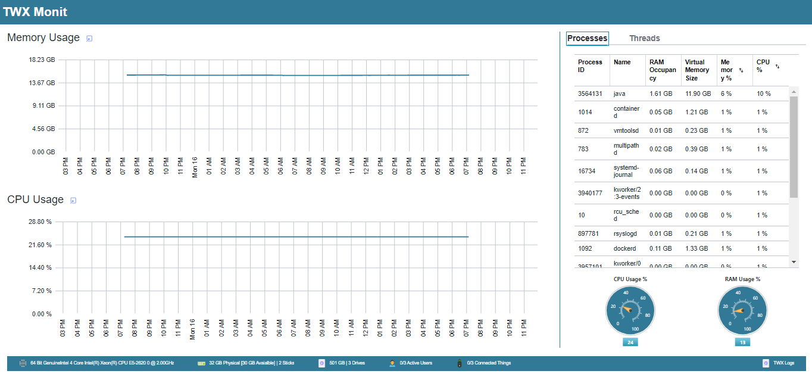

<h1  align="center" style="border-bottom: none">
    <b>
        TWX Monit
    </b>
</h1>
    <h4 align="center">An open-source tool to monitor ThingWorx platform/server performance</h4>
 
<!-- 

 -->
 

 

## Latest Binary

You can download the latest binary from the following link.

[V 0.1 Alpha](https://github.com/WGLabz/ThingWorx-Monit/releases/download/v0.1-alpha/With.Entites.ThingWorx.Metrices.zip) 

## Tools

- [ThingWorx Extension SDK](https://vuejs.org/)
- [ThingWorx Eclipse Plugin](https://www.electronjs.org/)

 

## 

## License

Distributed under the mit License. See `LICENSE.md` for more information.

 
